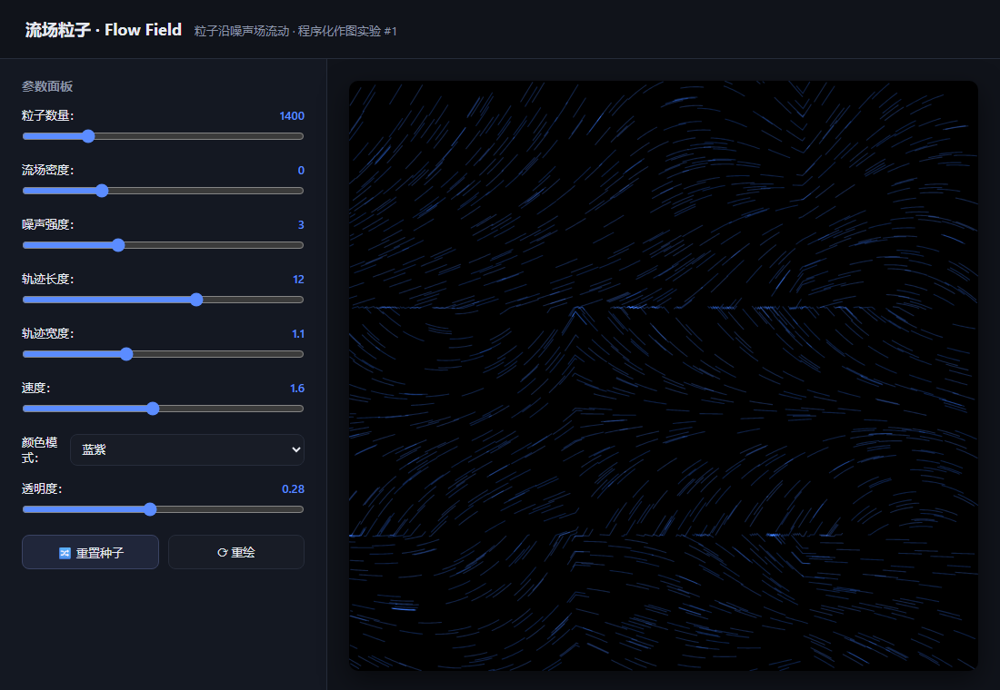
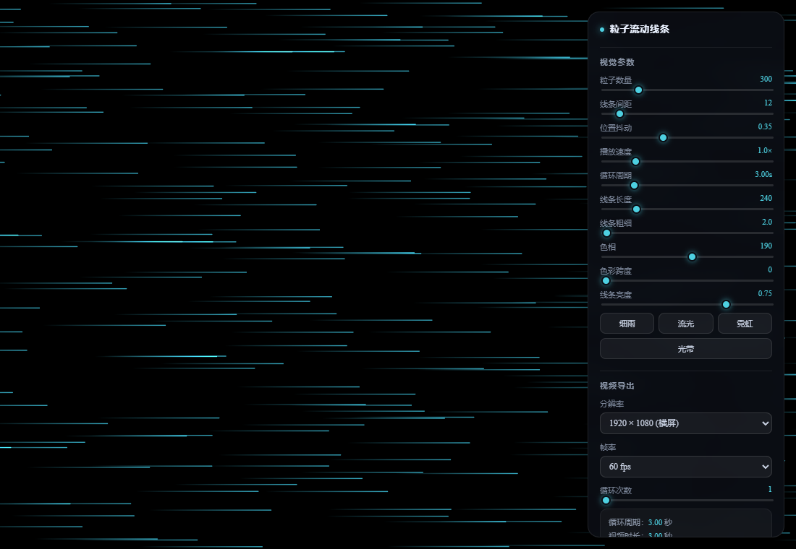
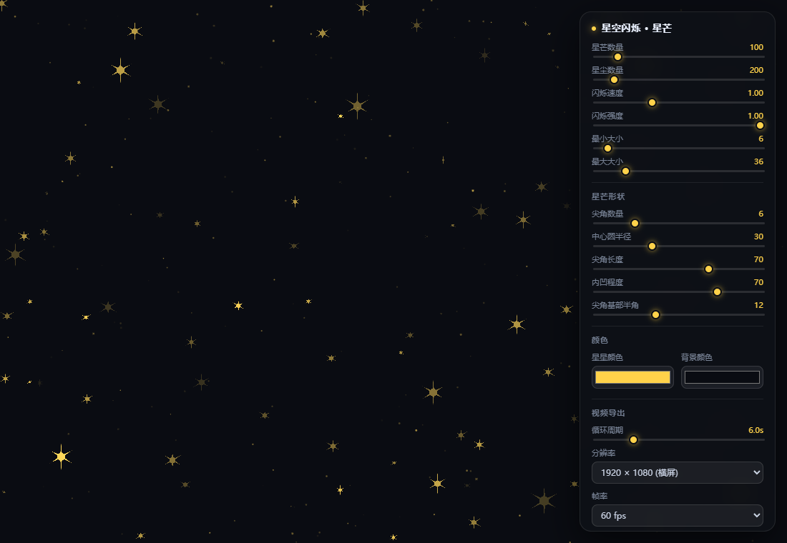
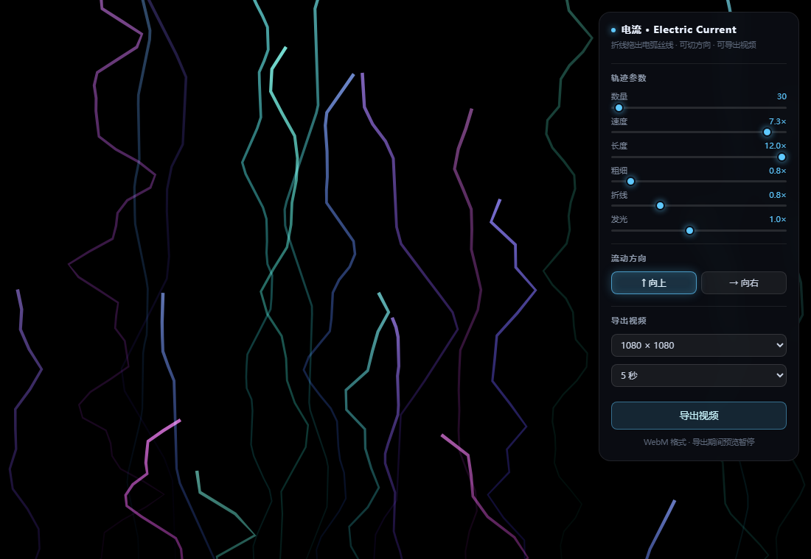
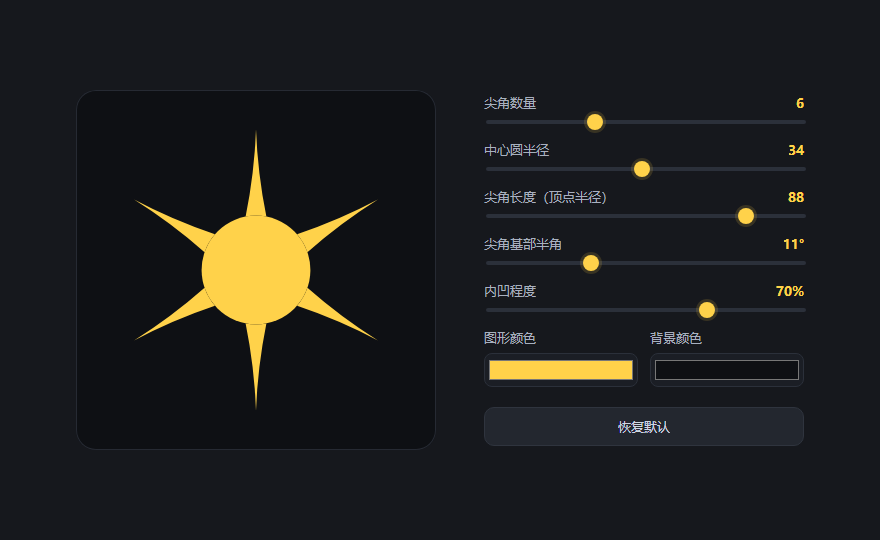
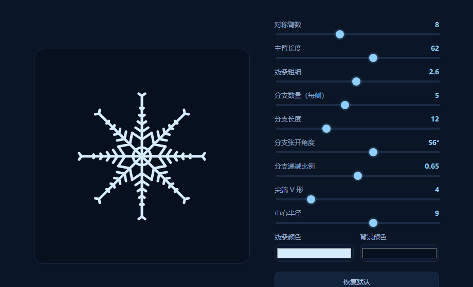
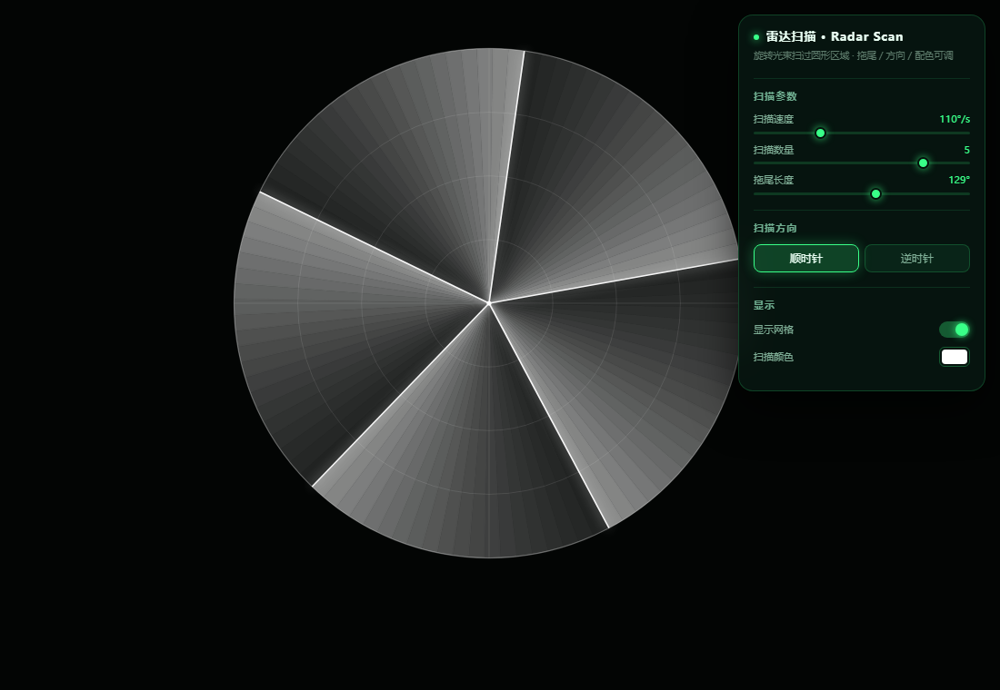
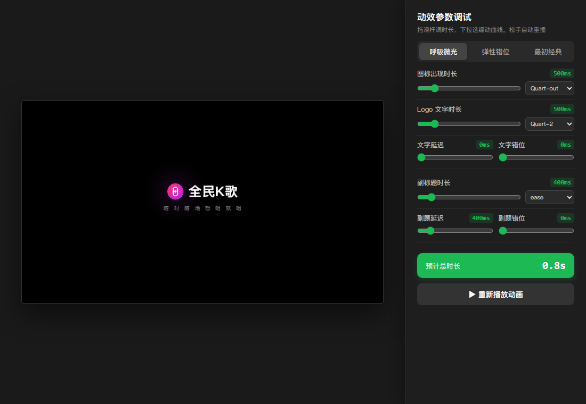

# procedural-drawing-lab · 程序化作图前哨实验场

> 纯前端、**零依赖单 HTML** 的生成式 / 程序化绘图实验集合：在浏览器里直观查看图形，配合**参数面板实时调参**，作为程序化作图的技术前瞻测试场。

## 这是什么

一个「算法画图」实验仓库。每个 `experiments/<分类>/` 下的独立 HTML 即一个实验，打开即可看到图形与参数面板，拖动滑杆 / 换种子秒级出效果。适合快速验证图形算法、界面动效方案再决定是否落到正式项目。

## 特性

- 零依赖、单文件，浏览器直接打开即用，无需构建
- 每图带**参数滑杆实时调参**；流场类实验另带可复现随机种子（几何图形是确定性的，无需种子）
- 部分实验支持**导出循环视频**（Canvas `captureStream` + `MediaRecorder`，输出 WebM/MP4）
- `index.html` 卡片式浏览，按分类 / 标签筛选，配真实截图
- 遵循 [knowledge-base 单项目规范](https://github.com/Simiely/knowledge-base) 维护

## 快速开始

1. 克隆本仓库
2. 打开 `index.html` 浏览全部实验，或直接双击任意 `experiments/*/*.html`
3. 拖动参数、点「重置种子 / 重新生成」，观察图形变化
4. 已在 GitHub Pages 在线部署，可直接访问 https://simiely.github.io/procedural-drawing-lab/

## 实验清单（索引）

| 截图 | 实验 | 分类 | 说明 | 参数要点 |
|---|---|---|---|---|
|  | [流场粒子 Flow Field](experiments/粒子动势/flow-field.html) | 粒子动势 | 粒子沿确定性噪声场流动成丝带 | 数量 / 密度 / 噪声强度 / 轨迹 / 配色 / 种子 |
|  | [粒子流动线条 Flow Lines](experiments/粒子动势/flow-lines.html) | 粒子动势 | 粒子水平拖出流光丝线，匀速横贯画面，**可导出循环视频** | 数量 / 间距 / 抖动 / 周期 / 长度 / 粗细 / 色相 / 亮度 + 导出分辨率·帧率·循环次数 |
|  | [星空闪烁 Starry Twinkle](experiments/粒子动势/starry-twinkle.html) | 粒子动势 | 星芒与星尘散布夜空，各自按周期闪烁，**可导出循环视频** | 星芒·星尘数量 / 闪烁速度·强度 / 大小范围 / 尖角数·中心圆·尖角长度·内凹·基部半角 / 颜色 + 导出周期·分辨率·帧率 |
|  | [电流 Electric Current](experiments/粒子动势/electric-current.html) | 粒子动势 | 折线轨迹拖出电弧丝线，锯齿可调，支持向上 / 向右两种流向，**可导出视频** | 数量 / 速度 / 长度 / 粗细 / 折线 / 发光 / 方向 + 导出分辨率·时长 |
|  | [星芒 Star Spikes](experiments/几何生成/star-spikes.html) | 几何生成 | 参数化星芒：尖角可旋转分布，内凹成芒 | 尖角数 / 中心圆半径 / 尖角长度 / 基部半角 / 内凹程度 / 颜色 |
|  | [雪花 Snowflake](experiments/几何生成/snowflake.html) | 几何生成 | 参数化雪花：分形分支 + 尖端 V 形，旋转复制对称 | 对称臂数 / 主臂与分支长度 / 张开角度 / 递减比例 / 尖端 V 形 |
|  | [雷达扫描 Radar Scan](experiments/径向扫描/radar-scan.html) | 径向扫描 | 多条光束自圆心同时旋转扫过圆形区域，拖尾呈扇形渐隐 | 扫描速度 / 扫描数量 / 拖尾长度 / 顺·逆时针 / 网格 / 扫描颜色 |
|  | [启动动画 Launch Splash](experiments/品牌动效/launch-splash.html) | 品牌动效 | 品牌 Logo 入场动效，3 套方案可切换，节奏与配色实时可调 | 入场方案 / 动画倍速 / 字符间隔 / 副标题延迟 / 渐变双色 / 副标题开关 / 自动轮播·间隔 |

## 目录规范（新增实验前必读）

```
experiments/
  _template/        # 新实验的复制骨架
  粒子动势/          # 粒子、湍流、流动类效果
  几何生成/          # 参数化几何图形、星芒、分形图案
  径向扫描/          # 旋转光束、雷达扫描类径向动效
  品牌动效/          # 品牌 Logo 入场、启动动画、界面转场类动效
  ...               # 新分类按需长出来（请登记到 AGENTS.md 目录表）
screenshots/        # 每个实验对应一张真实截图（<实验英文名>.png）
```

新增实验流程见 [DEVELOPMENT.md](./DEVELOPMENT.md)「如何新增一个实验」。

## 文档基线

| 文件 | 给谁看 | 说明 |
|---|---|---|
| [README.md](./README.md) | 用户 / 访客 | 本页 |
| [AGENTS.md](./AGENTS.md) | AI / 未来的你 | 技术栈、约定、目录分类、关键坑 |
| [DEVELOPMENT.md](./DEVELOPMENT.md) | 开发者 | 架构、如何新增实验、问题记录 |
| [CHANGELOG.md](./CHANGELOG.md) | 所有人 | 版本变更 |